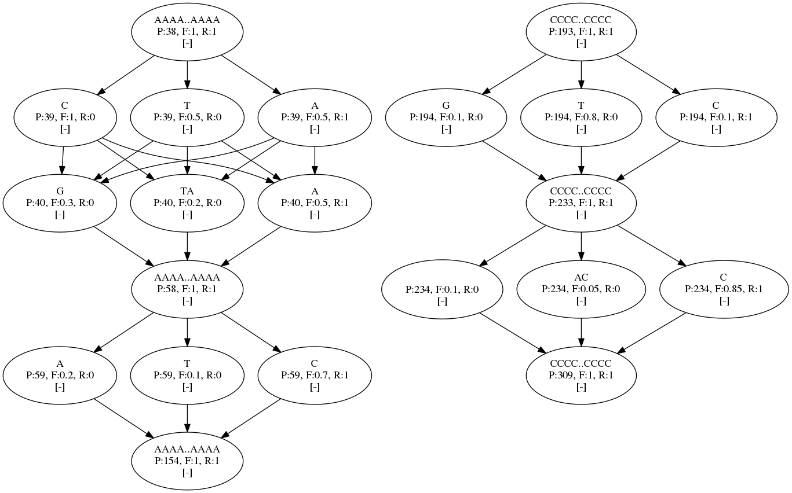
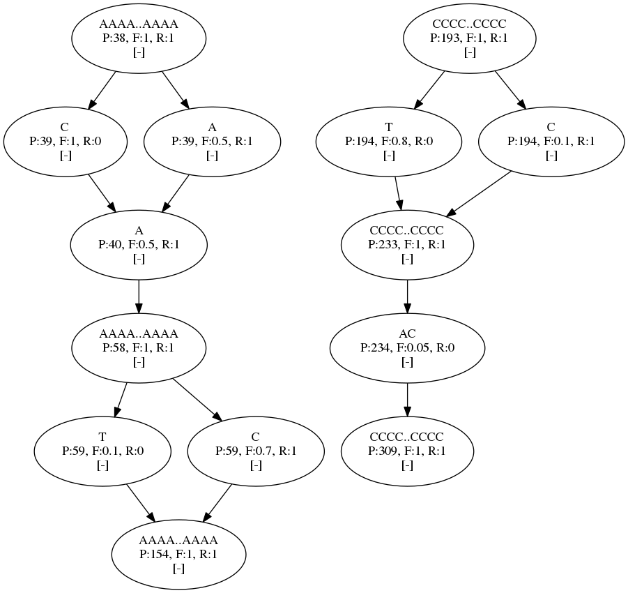
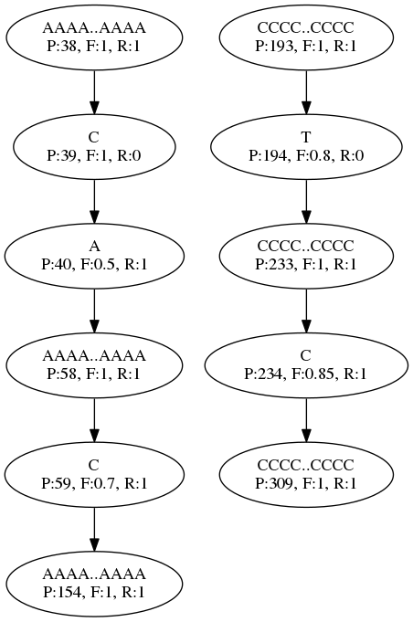

@brief Define a graph from a FASTA and VCF file

# Defining a Graph
_Updated: May 11, 2017_

```
vargas define --help

Define subgraphs deriving from a reference and VCF file.
Usage:
  vargas define [OPTION...]

 Required options:
  -f, --fasta arg  <str> *Reference FASTA filename.

 Optional options:
  -v, --vcf arg       <str> Variant file (vcf, vcf.gz, or bcf).
  -t, --out arg       <str> Output filename. (default: stdout)
  -g, --region arg    <CHR[:MIN-MAX];...> CSV list of regions. (default: all)
  -s, --subgraph arg  <str> Subgraph definitions, see below.
  -p, --filter arg    <str> Filter by sample names in file.

  -h, --help  Display this message.
```

In the simplest form, a linear graph can be defined with just a FASTA file. The graph can be constrained to certain regions:

```
vargas define -f GRCh38.fa -g "chr1;chr2;chr3:0-10,000,000;chr4"
```

Adding a VCF file will include variants into the graph. Variants can be restricted to certain samples using `--filter`.

# Subgraphs

A Hierarchy of graphs can be defined, and later alignments targeted at specific subgraphs. The whole graph, including all variants in the VCF, is the `base` graph. `ref` refers to the linear graph only consisting of reference nodes, and `maxaf` picks the nodes with the highest allele frequency.

Subgraphs are defined using the format "label=N[%]", where 'N' is the number of samples or percentage of samples to select. The samples are selected from the parent graph, scoped with ':'. For example : `a=50;a:b=10%;a:c=5`.

## Example

multigraph.vcf :

```
##fileformat=VCFv4.0
##contig=<ID=chrA>
##contig=<ID=chrB>
##INFO=<ID=AF,Number=A,Type=Float,Description="Allele Frequency">
#CHROM  POS ID  REF ALT QUAL    FILTER  INFO    FORMAT  SA  SB
chrA    40  rs775809821 A   T,C .   .   AF=0.5  GT  1|0 2|0
chrA    41  rs768019142 A   TA,G    .   .   AF=0.2,0.3  GT  2|1 0|0
chrA    60  rs62651026  C   T,A .   .   AF=0.1,0.2  GT  0|2 1|0
chrB    40  rs376007522 C   T,G .   .   AF=0.8,0.1  GT  0|2 0|1
chrB    80  rs796688738 C   AC,<CN0>    .   .   AF=0.05,0.1 GT  2|1 1|1 
```

multigraph.fa :

```
>chrA
AAAAAAAAAAAAAAAAAAAAAAAAAAAAAAA
AAAAAAAAAAAAAAAAAAAAAAAAAAAAAAA
AAAAAAAAAAAAAAAAAAAAAAAAAAAAAAA
AAAAAAAAAAAAAAAAAAAAAAAAAAAAAAA
AAAAAAAAAAAAAAAAAAAAAAAAAAAAAAA
>chrB
CCCCCCCCCCCCCCCCCCCCCCCCCCCCCCC
CCCCCCCCCCCCCCCCCCCCCCCCCCCCCCC
CCCCCCCCCCCCCCCCCCCCCCCCCCCCCCC
CCCCCCCCCCCCCCCCCCCCCCCCCCCCCCC
CCCCCCCCCCCCCCCCCCCCCCCCCCCCCCC
```

Defining with the defintion `"a=3;a:b=2;a:b:c=1"` will generate the `base`, `maxaf`, `ref`, `a`, `a:b`, and `a:b:c` graphs.

```
vargas define -f ref.fa -v ref.vcf -t ref.gdef -s "a=3;a:b=2;a:b:c=1"
```

Convering to DOT format, we can see the resulting graphs.

```
vargas query -d multigraph.gdef -d <graphname> -t <graphname>.DOT
```

### Base graph



### a:b graph



### Max allele frequency graph

